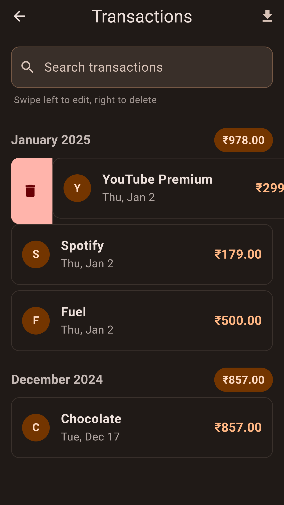

# Wallet - Expense Tracker App

**Wallet** is a **free and open-source** Flutter-based expense tracking application designed to help users manage their daily expenses efficiently. With a clean and user-friendly interface, Wallet allows users to add, edit, delete, and track their expenses seamlessly. The app also provides the ability to export expense data as a CSV file for further analysis or record-keeping.

## Features

- **Add Expenses**: Easily add expenses with a name, amount, and date.
- **Edit & Delete Expenses**: Modify or remove existing expenses with just a few taps.
- **Swipe to Edit/Delete**: Swipe left to edit or swipe right to delete an expense effortlessly.
- **Monthly Expense Summary**: View the total expenses for the current month.
- **Search Expenses**: Quickly find specific expenses using the search functionality.
- **Export to CSV**: Export all your expense data as a CSV file for offline use or analysis.
- **Undo Delete**: Accidentally deleted an expense? Use the undo feature to restore it.
- **Dynamic Theme**: Supports both light and dark themes, adapting to your device's settings.
- **Responsive Design**: Works seamlessly on both Android and iOS devices.

## Screenshots

    

        
    

    

        
    

    

        
    

    

        
    

    

        
    

    

        
    

## How to Download and Install

### Download APK
1. Go to the [Releases](https://github.com/yourusername/wallet/releases) section of this repository.
2. Download the latest APK file (`app-release.apk`).
3. Transfer the APK file to your Android device if downloaded on a computer.

### Install APK
1. On your Android device, navigate to the location where the APK file is saved.
2. Tap on the APK file to begin the installation.
3. If prompted, allow installation from unknown sources in your device settings.
4. Follow the on-screen instructions to complete the installation.

## How to Use

1. **Add an Expense**:
   - Open the app and enter the expense name and amount on the home screen.
   - Tap the checkmark button to save the expense.

2. **View and Manage Expenses**:
   - Navigate to the "Transactions" screen to view all your expenses.
   - **Swipe left to edit** or **swipe right to delete** an expense.

3. **Export Expenses**:
   - On the "Transactions" screen, tap the download icon in the top-right corner to export your expenses as a CSV file.

4. **Search Expenses**:
   - Use the search bar on the "Transactions" screen to filter expenses by name.

## Technologies Used

- **Flutter**: A UI toolkit for building natively compiled applications for mobile, web, and desktop from a single codebase.
- **SQFLite**: A local database to store expense data.
- **Provider**: State management for managing app data and UI updates.
- **Dynamic Color**: Supports dynamic theming based on the device's color scheme.
- **Share Plus**: Enables sharing the exported CSV file.
- **CSV**: Converts expense data into CSV format.

## Contributing

Contributions are welcome! If you'd like to contribute to this project, please follow these steps:

1. Fork the repository.
2. Create a new branch for your feature or bugfix.
3. Commit your changes and push the branch.
4. Submit a pull request with a detailed description of your changes.

## License

This project is licensed under the MIT License. See the [LICENSE](LICENSE) file for details.

Enjoy managing your expenses with **Wallet**! 💰📱